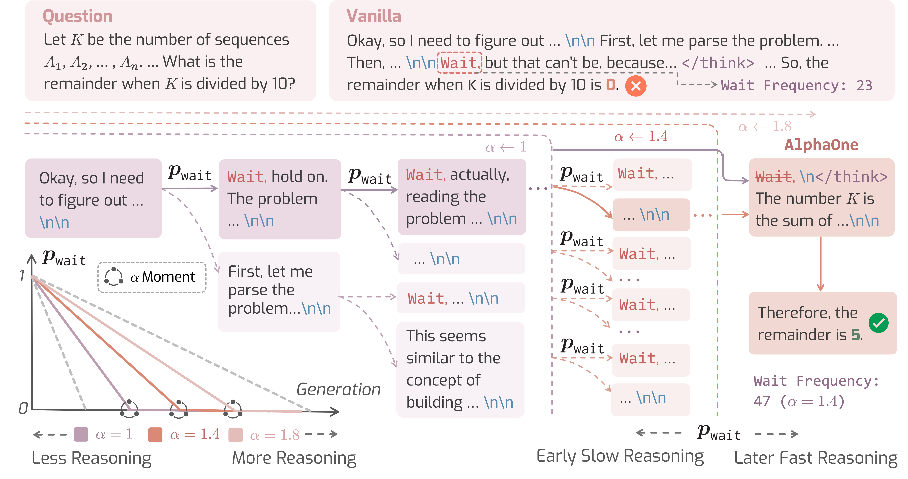

<p align="center">
<h1 align="center"><strong>AlphaOne: Reasoning Models Thinking Slow and Fast at Test Time</strong></h1>
  <p align="center">
    <a href='https://runpeidong.web.illinois.edu/' target='_blank'>Junyu Zhang </a><sup>&#8224;</sup>&emsp;
    <a href='https://runpeidong.web.illinois.edu/' target='_blank'>Runpei Dong </a><sup>&#8224;</sup>&emsp;
    <a href='https://rookiehb.github.io/' target='_blank'>Han Wang </a><sup></sup>&emsp;
    <a href='https://scholar.google.com/citations?user=-tpUy14AAAAJ&hl=en' target='_blank'>Xuying Ning </a><sup></sup>&emsp;
    <br>
    <a href='https://geng-haoran.github.io/' target='_blank'>Haoran Geng </a><sup></sup>&emsp;
    <a href='https://scholar.google.com/citations?user=GegXM9gAAAAJ&hl=en' target='_blank'>Peihao Li </a><sup></sup>&emsp;
    <a href='https://xialin-he.github.io/' target='_blank'>Xialin He </a><sup></sup>&emsp;
    <a href='https://yutongbai.com/' target='_blank'>Yutong Bai </a><sup></sup>&emsp;
    <a href='https://people.eecs.berkeley.edu/~malik/' target='_blank'>Jitendra Malik </a><sup></sup>&emsp;
    <br>
    <a href='https://saurabhg.web.illinois.edu/' target='_blank'>Saurabh Gupta </a><sup></sup>&emsp;
    <a href='https://www.huan-zhang.com/' target='_blank'>Huan Zhang</a><sup></sup>&emsp;
    <br>
    <sup></sup>University of Illinois Urbana-Champaign <sup>
    &emsp;&emsp;</sup> UC Berkeley
    <br>
    <sup>&#8224;</sup>: Equal contribution
    <br>
  </p>
</p>

</p>
<p align="center">
  <a href='https://arxiv.org/abs/2505.XXXXX'>
    </a>
  <a href='https://arxiv.org/pdf/2505.XXXXX.pdf'>
    </a>
  <a href='https://alphaone-project.github.io/'>
    </a>
  <a href='https://github.com/ASTRAL-Group/AlphaOne'>
    </a>
</p>

## 🏠 About
<div style="text-align: center;">
    
</div>

We present **AlphaOne (𝛼1)**, a universal framework for modulating reasoning progress in large reasoning models (LRMs) at test time. 𝛼1 first introduces 𝛼 moment, which represents the scaled thinking phase with a universal parameter 𝛼. Within this scaled pre-𝛼 moment phase, it dynamically schedules slow thinking transitions by modeling the insertion of reasoning transition tokens as a Bernoulli stochastic process. After the 𝛼 moment, 𝛼1 deterministically terminates slow thinking with the end-of-thinking token, thereby fostering fast reasoning and efficient answer generation. This approach unifies and generalizes existing monotonic scaling methods by enabling flexible and dense slow-to-fast reasoning modulation, while offering critical insights into the joint optimization of reasoning capabilities and computational efficiency.

🚧 **Code release under construction — stay tuned!** 🚧

## Contact
If you have any questions related to the code or the paper, feel free to email Junyu Zhang (`junyuz6@illinois.edu`) and Runpei Dong (`runpeid2@illinois.edu`).

## Citation
If you find our work useful in your research, please consider citing AlphaOne:

```Tex
@article{AlphaOne25,
    title={AlphaOne: Reasoning Models Thinking Slow and Fast at Test Time},
    author={Zhang, Junyu and Dong, Runpei and Wang, Han and Ning, Xuying and Geng, Haoran and Li, Peihao and He, Xialin and Bai, Yutong and Malik, Jitendra and Gupta, Saurabh and Zhang, Huan},
    journal={arXiv preprint arXiv:2505.XXXXX},
    year={2025}
}
```