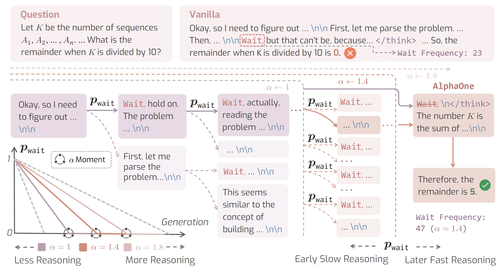

<p align="center">
<h1 align="center"><strong>AlphaOne: Reasoning Models Thinking Slow and Fast at Test Time</strong></h1>
  <p align="center">
    <a href='https://jyzhang1208.github.io/' target='_blank'>Junyu Zhang </a><sup>&#8224;</sup>&emsp;
    <a href='https://runpeidong.web.illinois.edu/' target='_blank'>Runpei Dong </a><sup>&#8224;</sup>&emsp;
    <a href='https://rookiehb.github.io/' target='_blank'>Han Wang </a><sup></sup>&emsp;
    <a href='https://scholar.google.com/citations?user=-tpUy14AAAAJ&hl=en' target='_blank'>Xuying Ning </a><sup></sup>&emsp;
    <br>
    <a href='https://geng-haoran.github.io/' target='_blank'>Haoran Geng </a><sup></sup>&emsp;
    <a href='https://scholar.google.com/citations?user=GegXM9gAAAAJ&hl=en' target='_blank'>Peihao Li </a><sup></sup>&emsp;
    <a href='https://xialin-he.github.io/' target='_blank'>Xialin He </a><sup></sup>&emsp;
    <a href='https://yutongbai.com/' target='_blank'>Yutong Bai </a><sup></sup>&emsp;
    <a href='https://people.eecs.berkeley.edu/~malik/' target='_blank'>Jitendra Malik </a><sup></sup>&emsp;
    <br>
    <a href='https://saurabhg.web.illinois.edu/' target='_blank'>Saurabh Gupta </a><sup></sup>&emsp;
    <a href='https://www.huan-zhang.com/' target='_blank'>Huan Zhang </a><sup></sup>&emsp;
    <br>
    <sup></sup> University of Illinois Urbana-Champaign <sup>
    &emsp;&emsp;</sup> UC Berkeley
    <br>
    <sup>&#8224;</sup>: Equal contribution
    <br>
  </p>
</p>

</p>
<p align="center">
  <a href='https://arxiv.org/abs/2505.24863'>
    </a>
  <a href='https://arxiv.org/pdf/2505.24863'>
    </a>
  <a href='https://alphaone-project.github.io/'>
    </a>
  <a href='https://github.com/ASTRAL-Group/AlphaOne'>
    </a>
</p>

## 🏠 About
<div style="text-align: center;">
    
</div>

We present **AlphaOne (𝛼1)**, a universal framework for modulating reasoning progress in large reasoning models (LRMs) at test time. 𝛼1 first introduces 𝛼 moment, which represents the scaled thinking phase with a universal parameter 𝛼. Within this scaled pre-𝛼 moment phase, it dynamically schedules slow thinking transitions by modeling the insertion of reasoning transition tokens as a Bernoulli stochastic process. After the 𝛼 moment, 𝛼1 deterministically terminates slow thinking with the end-of-thinking token, thereby fostering fast reasoning and efficient answer generation. 

This approach unifies and generalizes existing monotonic scaling methods by enabling flexible and dense slow-to-fast reasoning modulation, while offering critical insights into the joint optimization of reasoning capabilities and computational efficiency.

🚧 **Code release under construction — stay tuned!** 🚧

## 🛠️ Installation
Follow these steps to set up the environment for AlphaOne. Our installation is adapted from [Qwen2.5-Math](https://github.com/QwenLM/Qwen2.5-Math/tree/main/evaluation).

1. Create and activate the conda environment.

```bash
conda create -n alphaone python=3.10
conda activate alphaone
```

2. Install the required dependencies.

```bash
cd eval/latex2sympy
pip install -e .
cd ..
pip install -r requirements.txt 
pip install vllm==0.5.1 --no-build-isolation
pip install transformers==4.42.3
```

Now, launch your 𝛼1 LRMs and let the magic begin! 🚀

## 🎯 Quick Start
**Note: we recommend running evaluation scripts with output redirection**, for example,
```bash
nohup bash ./scripts/alphaone/eval_linear_deepseek_7b.sh >> deepseek-7b-alpha-1.4.log &
```
This makes it easier to monitor progress in real-time and keep track of multiple runs.

### AlphaOne Evaluation
We provide evaluation scripts for evaluating 𝛼1 LRMs on math and science benchmarks, such as **AIME24**, **AMC23**, **Minerva-Math**, **MATH500** and **OlympiadBench**.

To evaluate different models:
- For **DeepSeek-R1-Distill-Qwen-1.5B**:
```bash
cd AlphaOne/eval
./scripts/alphaone/eval_linear_deepseek_1_5b.sh
```
- For **DeepSeek-R1-Distill-Qwen-7B**:
```bash
cd AlphaOne/eval
./scripts/alphaone/eval_linear_deepseek_7b.sh
```
- For **Qwen QwQ-32B**:
```bash
cd AlphaOne/eval
./scripts/alphaone/eval_linear_qwq.sh
```
For **LiveCodeBench**, which focuses on code generation and execution, use the following script:
```bash
./scripts/alphaone/eval_linear_code.sh
```

### Baselines Evaluation

Refer to [docs/BASELINE.md](docs/BASELINE.md) for detailed instructions to run the Baselines evaluations.

## Acknowledgment
This repo builds on the excellent evaluation platforms [Qwen2.5-Math](https://github.com/QwenLM/Qwen2.5-Math/tree/main/evaluation) and [SEAL](https://github.com/VITA-Group/SEAL). Model deployment is powered by [vllm](https://github.com/vllm-project/vllm).

## Contact
If you have any questions related to the code or the paper, feel free to email Junyu Zhang (`junyuz6@illinois.edu`) and Runpei Dong (`runpeid2@illinois.edu`).

## Citation
If you find our work useful in your research, please consider citing AlphaOne:

```Tex
@article{AlphaOne25,
    title={AlphaOne: Reasoning Models Thinking Slow and Fast at Test Time},
    author={Zhang, Junyu and Dong, Runpei and Wang, Han and Ning, Xuying and Geng, Haoran and Li, Peihao and He, Xialin and Bai, Yutong and Malik, Jitendra and Gupta, Saurabh and Zhang, Huan},
    journal={arXiv preprint arXiv:2505.24863},
    year={2025}
}
```